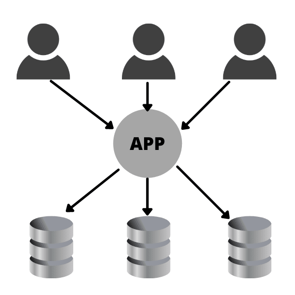

## Multitenancy example with mongodb 

### Using method of swiching connection from mongoose client pool connection.
**Requires**
-  .env file
-   running mongodb instance

## Action 
- cp .env.example .env
- npm install
- npm run seed (only for the seed )

## Application Architecture

