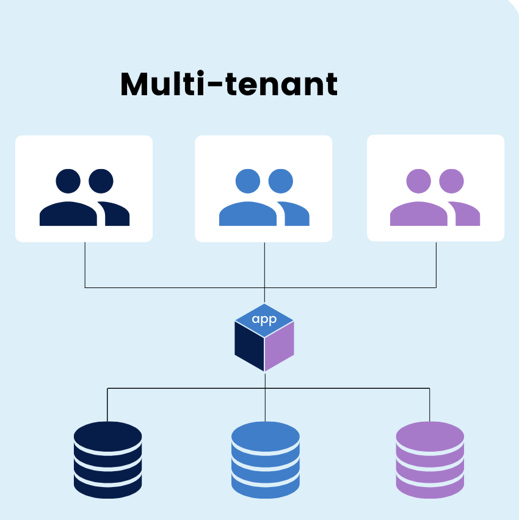

## Multitenancy with mongodb 
The Dynamic Multi-Tenant Employer Management System, crafted using Node.js and MongoDB, introduces an innovative approach to employer management. This system embraces a dynamic multi-tenancy architecture, where a unique database is created for each employer, ensuring unprecedented data isolation and security.

## Application Architecture

### Using method of swiching connection from mongoose client pool connection.
**Requires**
-  .env file
-   running mongodb instance

## Action 
- cp .env.example .env
- npm install
- npm run seed (only for the seed )
- npm start

## Result 
- Documentation here: 🔥🔥🔥 👉 - http://localhost:3000/docs

